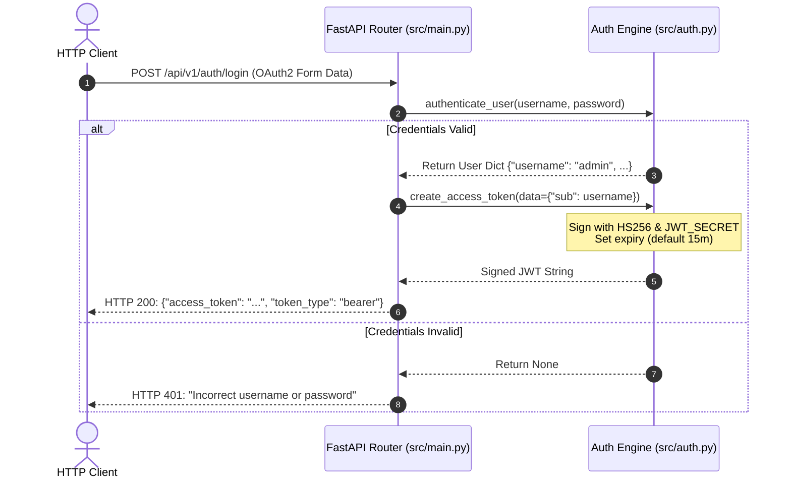
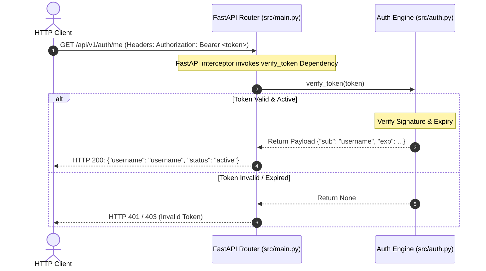

# Architectural Overview: Mini AuthService

The **Mini AuthService** is a lightweight, high-performance, stateless authentication microservice designed using the **FastAPI** framework in Python. It provides standard compliance for OAuth2 user authentication and session management using JSON Web Tokens (JWT). 

The service is structured to be stateless, highly scalable, and decoupled from heavy framework-specific runtimes, prioritizing rapid request validation and compliance with open standards.

---

## System Architecture & Components

The system is organized into a modular, clean-architecture pattern, dividing concerns into configuration, business logic/security, and the API delivery layer.

```
                      +-----------------------------+
                      |         HTTP Client         |
                      +--------------+--------------+
                                     |
                                     | (REST API / OAuth2)
                                     v
                      +--------------+--------------+
                      |      FastAPI Web Layer      |  <--- (`src/main.py`)
                      +--------------+--------------+
                                     |
                         (Delegates | Authenticates)
                                     v
                      +--------------+--------------+
                      |     Authentication Engine   |  <--- (`src/auth.py`)
                      +--------------+--------------+
                                     |
                         (Resolves Settings)
                                     v
                      +--------------+--------------+
                      |    Configuration Manager    |  <--- (`src/config.py`)
                      +-----------------------------+
```

### Component Breakdown

1. **API Delivery Layer (`src/main.py`)**:
   * Built on **FastAPI**, exposing REST endpoints.
   * Manages request parsing, input validation, HTTP exception mapping, and response serialization.
   * Leverages FastAPI's dependency injection container (`Depends`) to plug in authentication guards (see `FastAPI Dependency Injection`).

2. **Authentication Core (`src/auth.py`)**:
   * Contains the foundational security operations.
   * Responsibilities include user credential verification, cryptographic JWT issuance, and incoming token verification.
   * Uses symmetric cryptographic signing algorithms (`HS256`) detailed in `JWT Security`.

3. **Configuration Manager (`src/config.py`)**:
   * Provides a centralized, Single Source of Truth (SSOT) configuration object (`Settings`) housing environment settings, secrets, and integration endpoints. See `Configuration Management` for details on upgrading this layer.

---

## Core Data Flows

### Flow A: User Login & JWT Issuance (Authentication)

This flow illustrates how a client exchanges user credentials for a cryptographically signed access token.



### Flow B: Protected Resource Request (Authorization)

This flow demonstrates token verification used to authorize access to protected resources.



---

## Key Abstractions

### Dependency-Injection-Based Guards
The architecture utilizes FastAPI's declarative dependency injection engine. For example:
```python
@app.get("/api/v1/auth/me")
async def get_current_user(token_data: dict = Depends(verify_token)):
```
By abstracting JWT verification (`verify_token`) into a callable dependency, the endpoint handler remains free of cryptographic code and error handling. This abstraction pattern simplifies unit testing and makes it easy to secure other controllers. For details, see `FastAPI Dependency Injection`.

### Stateless Session Context
The application utilizes token-based identity verification. Instead of storing session records in a stateful database, identity context is derived cryptographically from the `sub` (subject) claim inside the verified JWT payload.

---

## Design Decisions & Trade-offs

| Design Decision | Rationale | Trade-off / Risk |
| :--- | :--- | :--- |
| **Symmetric Signing (HS256)** | Low computational overhead, highly performant validation. Simpler to implement than asymmetric schemes (like RS256). | Requires secure distribution and storage of the single shared `JWT_SECRET`. If compromised, attackers can forge identities. See `JWT Security`. |
| **OAuth2PasswordRequestForm Integration** | Standardizes incoming login requests; integrates natively with OpenAPI/Swagger interactive documentation. | Forces form-urlencoded payloads (`application/x-www-form-urlencoded`) rather than JSON request bodies. |
| **Stateless Architecture** | Allows the microservice to scale horizontally instantly behind an HTTP load balancer without session replication overhead. | Token revocation (e.g., user logout) cannot be easily achieved before token expiry without introducing state trackers (like a Redis denylist). |

---

## Security Posture & Architecture Recommendations

Reviewing the current state of the codebase reveals several areas requiring hardening prior to a production deployment:

1. **Config Management (12-Factor App Compliance)**:
   * **Current State**: The secret key (`JWT_SECRET`) and configuration are hardcoded inside `src/config.py`.
   * **Recommendation**: Refactor `Settings` to inherit from `pydantic-settings` to dynamically pull values from environment variables or secure key vaults (e.g., HashiCorp Vault, AWS Secrets Manager). Detailed in `Configuration Management`.

2. **Credential Storage & Authentication Source**:
   * **Current State**: User records and passwords are hardcoded in plain text inside `src/auth.py`.
   * **Recommendation**: Connect the logic to a mapped PostgreSQL database (`DATABASE_URL`). Store salted, Argon2id or bcrypt password hashes rather than raw strings.

3. **Secure Token Lifecycles**:
   * **Current State**: Uses short-lived access tokens (15 minutes), but lacks a refresh-token framework.
   * **Recommendation**: Implement a separate, secure `HTTPOnly` secure cookie-based Refresh Token endpoint to securely rotate access tokens without forcing periodic user re-login.