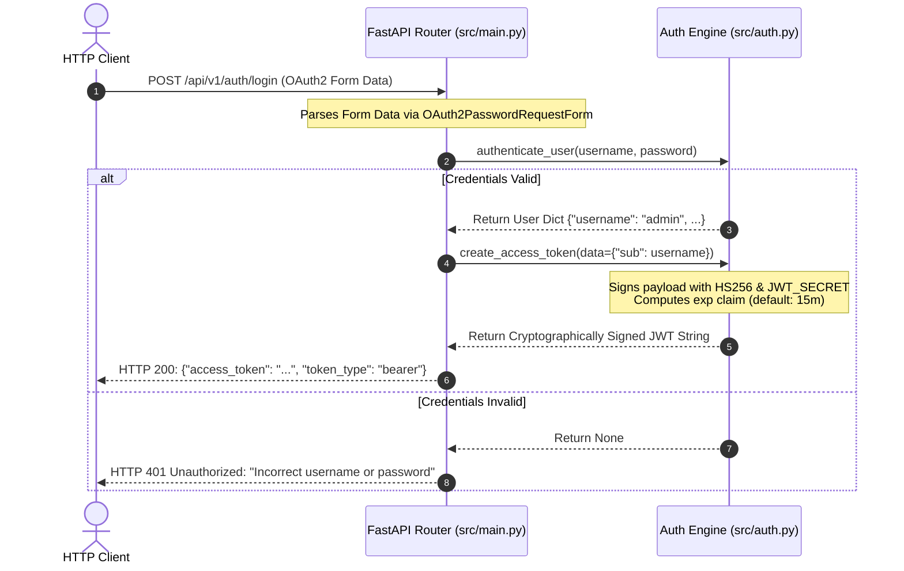
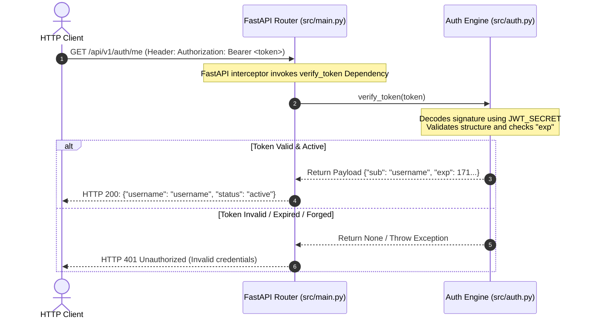

<!-- anchor: src/main.py:L1-L100 sha:HEAD -->

# Architectural Overview: Mini AuthService

The **Mini AuthService** is a lightweight, high-performance, stateless authentication microservice built on the **FastAPI** framework in Python. Designed to function as an independent service within a distributed microservices environment (see the global [[index]]), it implements standard-compliant OAuth2 workflows and issues cryptographically signed JSON Web Tokens (JWT) to secure downstream resources.

The service's core architectural tenets emphasize rapid validation, horizontal scalability, minimal runtime memory usage, and strict adherence to open industry security standards.

---

## Component Architecture

The codebase follows a modular design pattern that isolates concerns into three discrete layers: the Web Delivery Layer, the Authentication Engine, and the Configuration Manager.

```
                      +-----------------------------------+
                      |            HTTP Client            |
                      +-----------------+-----------------+
                                        |
                                        | (REST API / OAuth2 Form-Data)
                                        v
                      +-----------------+-----------------+
                      |     FastAPI Web Delivery Layer    |  <--- [[entities/src-main]]
                      +-----------------+-----------------+
                                        |
                        (Injects Guards | Delegates Work)
                                        v
                      +-----------------+-----------------+
                      |     Core Authentication Engine    |  <--- [[entities/src-auth]]
                      +-----------------+-----------------+
                                        |
                            (Reads Settings & Secrets)
                                        v
                      +-----------------+-----------------+
                      |      Configuration Manager        |  <--- [[entities/src-config]]
                      +-----------------------------------+
```

### Component Breakdown

1. **API Delivery Layer ([[entities/src-main]])**:
   * Leverages **FastAPI** to expose fast, auto-documented, asynchronous REST endpoints.
   * Directs parsing of form-urlencoded input, maps cryptographic execution exceptions to structured HTTP responses, and handles serializing outbound token responses.
   * Utilizes FastAPI's declarative dependency injection container to evaluate modular authentication guards across protected endpoints (see [[concepts/fastapi-dependency-injection]]).

2. **Core Authentication Engine ([[entities/src-auth]])**:
   * Houses the central security domain logic of the application.
   * Responsible for verifying raw user credentials, issuing cryptographically signed JWT strings, and inspecting/verifying inbound tokens.
   * Signs payloads utilizing the HS256 symmetric signature algorithm as detailed in [[concepts/jwt-security]].

3. **Configuration Manager ([[entities/src-config]])**:
   * Operates as the centralized, Single Source of Truth (SSOT) configuration object (`Settings`).
   * Holds the service runtime state, external database connection strings, and security properties (such as key length and token algorithms). See [[concepts/configuration-management]] for upgrading this component to modern architectural environments.

---

## Core Data Flows

Detailed sequence logic outlining the client-service interactions for login and authorization. For a deep dive into sequence steps, verify the unified guide on [[concepts/authentication-flows]].

### 1. User Login & Access Token Generation (Authentication)

This flow illustrates how a client exchanges user credentials for a cryptographically signed access token using standard OAuth2-compatible inputs.



### 2. Protected Resource Request (Authorization)

This flow demonstrates token verification used to authorize access to protected resources.



---

## Key Architectural Patterns

### Declarative Dependency Injection
The service leans heavily into FastAPI's native dependency injection engine to achieve modular separation of concerns. Instead of endpoints manually extracting and parsing HTTP headers, cryptographic signature verification functions as an inline guard:

```python
@app.get("/api/v1/auth/me")
async def get_current_user(token_data: dict = Depends(verify_token)):
    # The endpoint only executes if verify_token succeeds and returns a valid payload
```

This pattern keeps routing files thin, decouples cryptographic code from business controllers, and allows easy mocking of user identities in unit test suites. Details on these guard constructs are explained in [[concepts/fastapi-dependency-injection]].

### Stateless Security Model
Unlike legacy monolithic frameworks, the Mini AuthService enforces a strictly stateless security posture:
* Session records are never retained in database tables or shared key-value caches like Redis.
* User identity contexts are derived on the fly by cryptographically validating and parsing self-contained payload claims inside the JWT token (see [[concepts/stateless-sessions]]).
* This allows instant, frictionless horizontal scaling across thousands of independent nodes since no session persistence is replicated.

---

## Architectural Decisions & Design Trade-offs

During the design phase of the Mini AuthService, several architectural trade-offs were made. These decisions balance development speed, structural complexity, and operating performance:

| Architectural Decision | Rationale | Trade-off / Risk | Associated ADR |
| :--- | :--- | :--- | :--- |
| **Symmetric HS256 Signing** | Eliminates asymmetric mathematics overhead; lowers execution latency; simplifies microservice key setup. | Requires highly secure, synchronized distribution of the master `JWT_SECRET`. | [[decisions/symmetric-vs-asymmetric-signing]] |
| **OAuth2 Form Integration** | Integrates natively with Python web clients and provides out-of-the-box Swagger UI interactive security login tools. | Demands client applications format login payloads as `application/x-www-form-urlencoded` instead of arbitrary JSON content. | [[decisions/oauth2-form-integration]] |
| **Stateless Identity Sessions** | Enables immediate horizontal scalability behind load balancers with zero data replication overhead. | Eliminates standard direct token revoking options (e.g. logging out immediately requires building an auxiliary denylist cache). | [[decisions/stateless-session-tradeoff]] |
| **PostgreSQL & Argon2id Migration** | Replaces mock credential collections with production-grade security and state-of-the-art password-hashing techniques. | Adds database connection configuration requirements and introduces latency overhead during the login flow. | [[decisions/database-credential-storage]] |
| **Token Lifecycle Isolation** | Implements secure, isolated token layers combining temporary short-lived credentials with decoupled refresh structures. | Increases client consumption complexity; requires managing secure HttpOnly cookie domains. | [[decisions/token-lifecycle-refresh]] |

---

## Current Architecture Limitations & Hardening Path

While the baseline codebase demonstrates functional OAuth2 patterns, it represents an early, unhardened developmental state. Deploying the service to a production environment requires implementing the following critical architectural upgrades:

1. **Secrets Security & 12-Factor Compliance**:
   * *Current State*: Config properties (such as `JWT_SECRET` and algorithms) are written as hardcoded plaintext strings inside [[entities/src-config]].
   * *Required Change*: Replace `Settings` attributes with Pydantic-Settings fields to load variables dynamically from the operating container's environment (or external parameter stores like AWS Secrets Manager). Refer to [[concepts/configuration-management]] for the path to 12-factor compliance.

2. **Persistent Identity & Hash Hardening**:
   * *Current State*: The authorization logic in [[entities/src-auth]] validates credentials using a mock hardcoded in-memory conditional check (`"admin" == "secret123"`).
   * *Required Change*: Bind the service to a structured PostgreSQL layer. Store user passwords with highly secure Argon2id hashes, ensuring that raw strings are never stored or evaluated in memory. Detail is documented in [[decisions/database-credential-storage]].

3. **Secure Token Lifecycle Strategies**:
   * *Current State*: The service relies solely on short-lived access tokens, requiring users to log in again every 15 minutes once their token expires.
   * *Required Change*: Establish secondary long-term Refresh Tokens transmitted inside secure, HTTPOnly, SameSite cookies. This isolates and extends session lifecycles safely without leaving client apps vulnerable to cross-site scripting (XSS). Learn more in [[decisions/token-lifecycle-refresh]].